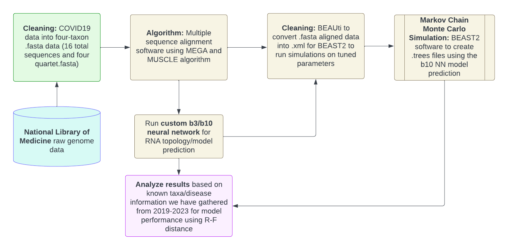

## Our Workflow


## Data & Cleaning

We have already preprocessed and multi sequence aligned our SARS-Cov-2 dataset located under the folder `custom_covid_dataset`. If you want to align more proprietary data collected in .fasta format, run the MUSCLE alignment on MEGA (https://www.megasoftware.net/) or msa alignment script. 

## Dependencies and Conda Environment
To setup the dependencies, simply run:
```
pip install -r requirements.txt
```

To setup the Tensorflow conda environment, run:
```
conda create --name cs4775proj 
conda activate cs4775proj 
conda install tensorflow
```

You can also conda install the requirements you need from requirements.txt if you choose


## Run NN Model/Topology Predictions (instructions from this paper: https://www.biorxiv.org/content/10.1101/2023.07.12.548770v1.article-metrics):

**DISCLAIMER: We refactored the NN repository to WORKS FOR WINDOWS 11+ currently as our team members used windows instead of mac/linux.**

If you want the original linux/mac compatability consult the repository in the paper and re-run the .py scripts from below.

Run this to create an instance of quartet-pattern-counter-v1.1.exe if you don't have one already (should be a build currently in the neural_network folder)
```
cd neural_network
cd quartet-pattern-counter-v1.1_src/
make
```

```
python3 ModelPredictorLoaded.py -sequence_type (*) -NN_name (**) -alignment_file (***)
```
where -sequence_type is DNA or AA
-NN_name is a name of the substitution model neural network predictor folder
-alignment_file is a name of the multiple-sequence-alignment file
For trained topology neural network run:

```
python3 TopologyPredictorLoaded.py -sequence_type (*) -NN_name (**) -alignment_file (***) -substitution_model (****)
```

where -sequence_type is DNA or AA
-NN_name is a name of the substitution model neural network predictor folder
-alignment_file is a name of the multiple-sequence-alignment file
-substitution_model is 'JC','K2P','F81','F84','HKY','GTR' - nucleotide substitution models

Download more topology weights here (we only included GTR in our repo): https://datadryad.org/stash/dataset/doi:10.5061/dryad.ksn02v783

For specific numpy/ PolyMoSim simulation data email the authors of the paper and they will give you access to the dataset (it is over 200gb so we emailed them for private access as well but can't share it)


## BEAUti and BEAST2 Markov Chain Monte Carlo Simulation
We have the .xml files generated from BEAUti in `custom_covid_dataset/sample 1 monte carlo`, etc for samples 1-4. If you want to generate your own .xml files with differing prior models or substitution models, download BEAST2 here: https://www.beast2.org/, open up BEAUTi, drag in one of the .fasta files from `custom_covid_dataset` and adjust your parameters. For simplicity, we chose the Birth Death Model with all other parameters on the "estimate" option. For the MCMC simulation, you can run BEAST2.exe directly with the .xml files located in our `custom_covid_dataset/sample {1,2,3,4} monte carlo` we generated to yield a .trees file. Convert the last simulated tree to a .nwk file from this simulation.

## Final Result Analysis
Run `nwk_tree_analysis/plot_nwk.py` and `nwk_tree_analysis/rf_distance_compare.py` to plot nextstrain plots vs. simulated ones as well as get the rf distance between them. Substitute the hard coded parameters in the comparison script to compare any two nwk sequences.